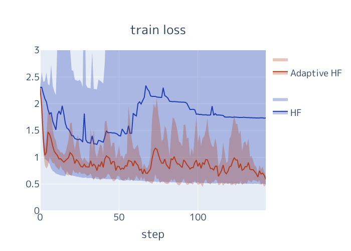
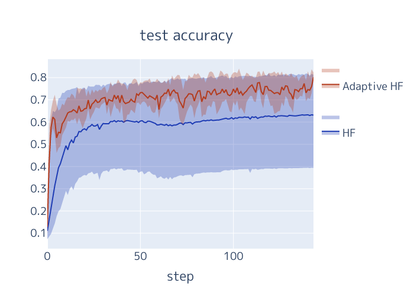

# Adaptive Hessian-free Optimization
- Adaptive Hessian-free optimization for training neural networks
  - NeurIPS Workshop on OPT2020: 12th Annual Workshop on Optimization for Machine Learning

<!-- 
 -->


## Required
- Docker version 19.03.2
- docker-compose version 1.24.1
## Set up
#### Build container
```bash
$ cd build-env
$ docker-compose build
$ docker-compose run adaptive-hf /bin/bash
```

## Training model using Adaptive-HF
#### Example
```bash
$ (adaptive-hf) cd /code/adaptive-hessian-free-optimization
$ (adaptive-hf) python exp/training.py
```

#### Argments
- --arch: model architecture, default is 'LeNet'.
- --gpu-num: GPU Device number, default is 1.
- --seed: random seed for training model, default is 1.
- --batch-size: input batch size for training model, default is 128.
- --epochs: number of epochs for training model, default is 10.
- --lr: learning rate, default is 0.001.
- --damping: damping rate for constract a positive-definite Hessian matrix, default is 10.
- --beta2: hyperparameter of Adam, default is 1e-8.

The following three parametes are the unique hyperparameters of Adaptive-HF.
- --cg-epsilon: default is 1e-3.
- --cg-sigma: the upper bound of the conjugate gradients, default is 50.
- --cg-L-smoothness: the lower bound of L-smoothness, default is 100.

